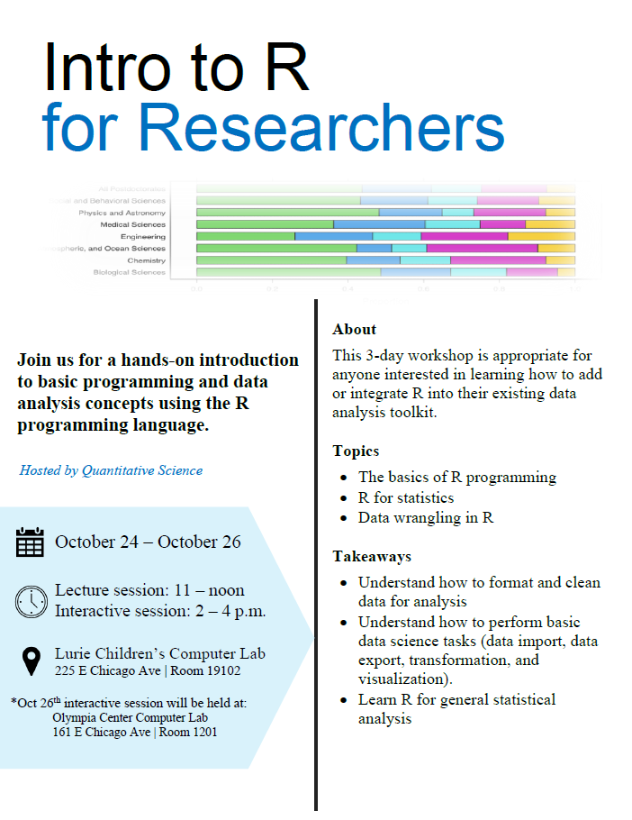

# introR

Welcome to the github repository for the Summer 2023 *"Intro to R for Researchers"* workshop hosted by Manne Research Institute's Quantitative Science pillar.

Workshop website: https://stanley-manne-childrens-research.github.io/introR/

